# cloud-c4c-ticket-duplicate-finder

## Introduction

SAP Cloud for Customer allows your company sales and support teams to engage with customers across multiple channels. You can use SAP Cloud Platform to develop, deploy and host SAP Cloud for Customer extension applications that simplify and differentiate your business processes. 

The sample extension application for SAP Hybris Cloud for Customer that we’ll be working with today - *SAP Duplicate Ticket Finder* - helps support employees in finding duplicate tickets reported for the same customer issues.

## Extension Applications Overview

SAP duplicate ticket finder is a simple Java-based extension application, that demonstrates the integration capabilities, between SAP Cloud for Customer and SAP Cloud Platform.

Implementing extension application hosted on the SAP Cloud Platform allows developers to take full advantage of the platform capabilities and implement fully-fledged business processes. With the broad set of platform services at your disposal, your extension applications can expand into many scenarios that are impossible or impractical to achieve with an in-app extensibility.


Extension applications have the following characteristics:
* implement business logic and/or data processing in Java Web container hosted on the platform
* consume SAP Cloud for Customer data using OData or SOAP APIs
* provide back-end services for UI or SAP Cloud for Customer consumption
* can host secure and rich user interface, that can be either embedded or standalone


## Application Scenario

Ticket processing is done by Service Agents in SAP Cloud for Customer. For most businesses, improving the customer service quality is a main component for success, driving loyalty and customer satisfaction. Main component for this is improving the efficiency of the Service Agents. A key enabler for achieving this is improving the efficiency of the Service Agents. Finding a solution to customer problems fast, reducing duplicate work for service request investigation and reacting on most common customer challenges adequately is an area for innovation that can be explored by extension application developers.

Duplicate ticket finder sample application is focusing on this business case, by offering simple integrated solution to find and classify tickets reported or related to the same customer problem. The ultimate goal of the application is to demonstrate the technical integration points between SAP Cloud for Customer and SAP Cloud Platform Extension Applications in the context of a realistic business scenario. It can be used as a template for gaining knowledge on how to implement extension applications for SAP Cloud for Customer using SAP Cloud Platform. 

The application use-case is:

1. The customer files a new ticket in SAP Cloud for Customer describing the problem in the subject.
2. The Service Agent opens the customer ticket for processing and checks for suggested groups of similar tickets in the Duplicate Ticket Finder Widget.
3. The Service Agent can open the suggested related tickets and inspect their statuses and proposed solutions.
4. If the Service Agent finds that the ticket problem applies to a group of similar tickets, he or she might add his or her ticket to the group.
5. Other Service Agents immediately see the new ticket in the group and can reuse the proposed solution.

## Application Architecture Details

Service requests filled by people are usually a mixture of both structured and unstructured information. Finding semantic similarities between two tickets is non-trivial task, that might employ many technology tools - ticket metadata analysis, text heuiristic analysis and even machine learning.

SAP Duplicate Ticket Finder implements very simple algorithm which uses the ticket description as indicator for similarities. It uses OData APIs to extract the tickets from the Cloud for Customer system and builds [Lucene](https://lucene.apache.org/core/) in-memory index. When new ticket is created it gets added to the index. When two tickets are catergorized by users as duplicate they get merged in the index, so they appear in the same group. All data is kept in memory, so the index gets lost after application restart.

The UI is implemented as native HTML mashup in SAP Cloud for Customer. In order to connect to the Java backend logic, it uses 2 Web Service mashups, which obtain the groups of similar tickets to the current ticket and allow  the user to add the current ticket to existing group of duplicates.

OData notification feed subscription is used in order to trigger asynchronous ticket replication.  


The main focus is on the following integration points:

* Simple standalone interface protected with FORM authentication and Single Sign-On with SAP Cloud for Customer shows status of the application
* Setting up connectivity for System to System integration using OData API - used in order to fetch the Service Request tickets
* Exposing services on the SAP Cloud Platform and consuming these services in SAP Cloud for Customer - used in order to integrate the native HTML mashup with the Java application backend
* Developing and Configuring Extension Application UIs in SAP Cloud for Customer - in order to show Ticket Duplicate Finder interface in ticket processing screen
* Receiving event notifications upon business object changes in SAP Cloud for Customer - in order to implement real time ticket replication and analysis

## Prerequisites

* SAP Cloud for Customer tenant and user with administrative privileges for performing the required configurations
* SAP Cloud for Customer service agent user credentials required for asynchronous access to tickets
* SAP Cloud Platform Extension subaccount for SAP Cloud for Customer extensions. To configure such subaccount follow the SAP Cloud Platform documentation for [Extending SAP Cloud for Customer](https://help.sap.com/viewer/462e41a242984577acc28eae130855ad/Cloud/en-US).  
* Browser with HTML5 Support 
* Eclipse IDE for Java EE Developers - Oxygen version
* Java SE Development Kit (JDK, not JRE), version 8
* SAP Cloud Platform Tools for Eclipse: https://tools.hana.ondemand.com/oxygen/
* SAP Cloud Platform SDK: https://tools.hana.ondemand.com/

## Installation Steps

* Import Duplicate Ticket Finder Java application in your Eclipse IDE. 
* Build and Deploy Duplicate Ticket Finder Java application on SAP Cloud Platform Extension Account.
* Configure SAP Cloud for Customer OData API access, using a technical user.
* Configure OData Event Notification in SAP Cloud for Customer for creating tickets.
* Create and configure Web Service Mashups in SAP Cloud for Customer for your application.
* Create and configure HTML Mashup Interface in SAP Cloud for Customer for your application.
* Embed the application interface in SAP Cloud for Customer UI.

## Import and Build Duplicate Ticket Finder Application in Eclipse IDE

1. In the *Eclipse IDE*, click on the *Open Perspective* button in the top right corner and choose Git.

   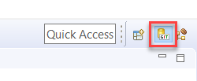
2. Select Clone a Git repository from *Git Repositories* view. 

   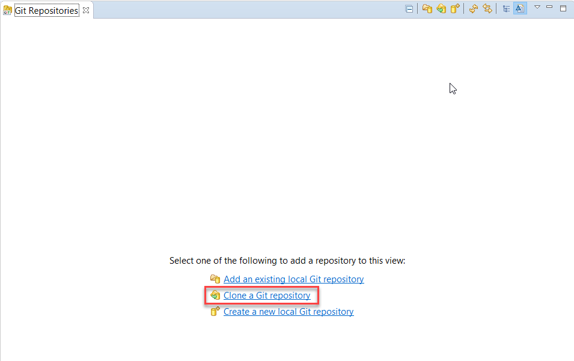
3. Enter https://github.com/SAP/cloud-c4c-ticket-duplicate-finder-ext.git in the URI field and choose *Next*.

   
4. Select the *teched_2018* branch and choose *Next*.

   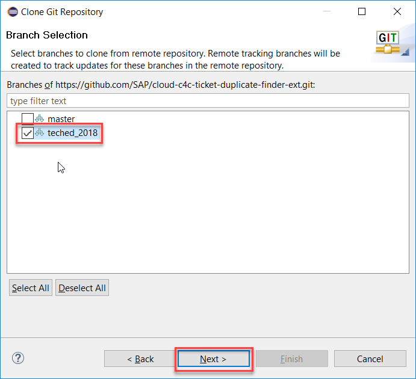
5. Set the *Directory* field and choose *Finish*. Take a note of that directory, we will refer to it as *Project Folder* later in the exercises.

   
6. Click again on the *Open Perspective* button in the top right corner and choose *Java EE*.

   
7. Choose *File* > *Import* > *Maven* > *Existing Maven Projects* and choose *Next*. 

    
8. Browse and select the *Project Folder* where you have cloned the Git repository and choose *Finish*. Wait for the project to load.

   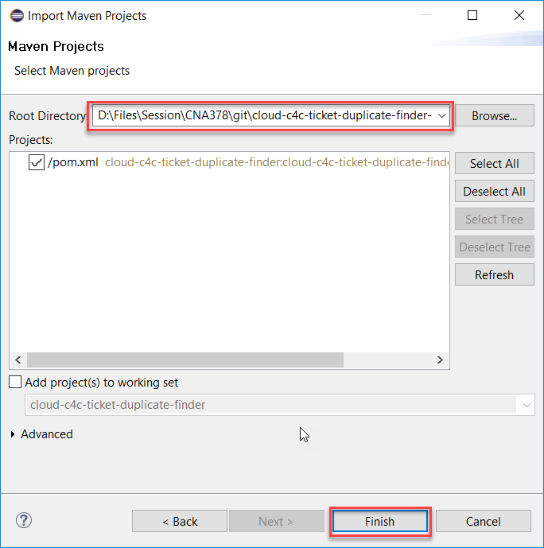 
9. From the project context menu, choose *Run As* > *Maven build*. Enter *clean install* in the *Goals* field and choose Run. 

   You should see a **BUILD SUCCESS** message in the Console view.

   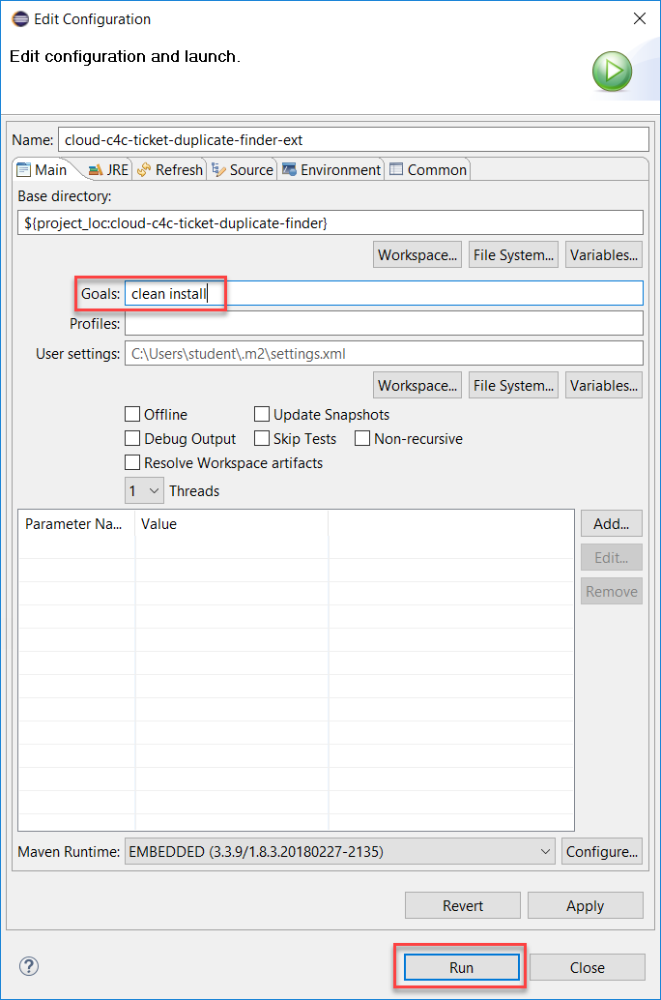
   

## Deploy the Application via the SAP Cloud Platform Cockpit

1. In the onboarding page, click on the *SAP Cloud Platform Subaccount* link. The SAP Cloud Platform Cockpit is loaded.
   
   

2. Choose *User information* in the top right corner and note your S/P-user ID.

   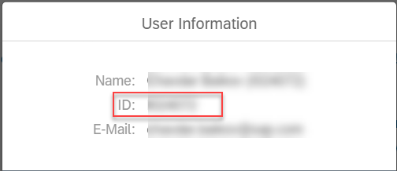

3. In the left-hand navigation menu, choose *Applications* > *Java Applications*.

4. Choose *Deploy Application* and in the dialog box that appears, enter the following values:

    - WAR File Location: ROOT.war in your Eclipse <Project Folder>/target folder
    - Application Name: tdf<your s/p-user ID> (only lowercase letters, e.g. tdfp1234567890)
    - Runtime Name: Java Web Tomcat 8
    - JVM Version: JRE 8

   Choose *Deploy*.

   

5. Do NOT start the application at this point. Choose *Done*.
   
   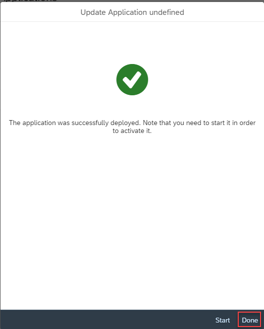

## Configuring the Application Connectivity to SAP Cloud for Customer OData API Using Technical User

The application replicates and indexes the ticket information from the SAP Cloud for Customer system using OData API. During startup it replicates the last 20 tickets in the system and adds them in the index.

You need to configure the API access to SAP Cloud for Customer system for your application by creating the required OAuth client and SAP Cloud Platform destination. You also need a service user with permissions for accessing the service tickets.

1. For configuring OAuth client you need to know the Service Provider name of your SAP Cloud Platform subaccount.

   Open your subaccount and chose *Secirity* > *Trust* from the left menu. Note the value of *Local Provider Name* in *Trust Management* settings.
   
   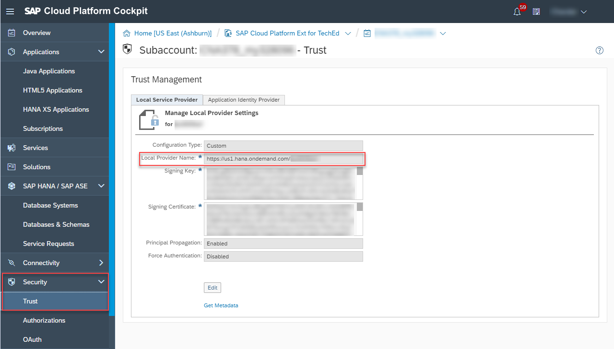

2. Logon to SAP Cloud for Customer System and choose *ADMINISTRATOR* > *OAUTH2.0 CLIENT REGISTRATION* and select *New*

   

3. On OAuth 2.0 Client Registration screen configure the client parameters:

    - *Client ID* is automatically generated client identifier. You will need to remember this for SAP Cloud Platform destination configuration.
    - *Client Secret* - Enter your secred. You will need to remember this for SAP Cloud Platform destination configuration.
    - *Description* - Suitable description for your client. Use : "<ApplicationName> Client" (e.g "tdfp0123456789 Client").
    - *Issuer Name* - Select your SAP Cloud Platform Subaccount Service Provider. This is configured as OAuth 2.0 Identity Provider in SAP Cloud for Customer.
    - *Scope* - Under scope select *UIWC:CC_HOME*

   Choose *Save and Close* after the configuration is complete.

   

4. For configuring OAuth destination in SAP Cloud Platform you need to know the Service Provider name of your SAP Cloud for Customer tenant.

   Logon to SAP Cloud for Customer System and choose *ADMINISTRATOR* > *COMMON TASKS* and select *Configure Single Sign-On*

   

   Note the *SAP Cloud for Customer Service Provider* name from *Local Service Provider* property in *Configure Single Sign-On* screen.

   

5. Open subaccount overvew in SAP Cloud Platform Cockpit. In the left-hand navigation menu, choose *Applications* > *Java Applications*, then choose your application in the list of Java applications.

   

6. In the left-hand navigation menu, choose *Configuration* > *Destinations*, then *Import Destination*.

   Choose the *sap_cloud4customer_odata.txt* template file in the <Project Folder>/src/main/resources folder and configure the following values:

    - *URL* - SAP Hybris Cloud for Customer API URL. Replace *"<C4C Host>"* with your SAP Cloud for Customer API host name. Check the onboarding page for API URL reference
    - *Audience* - SAP Cloud for Customer Service Provider name. (Use exact copy of the url do not change any letters e.g. *HTTPS://my328096-sso.crm.ondemand.com*
    - *Client Key* - OAuth Client ID you created for your application
    - *Token Service URL* - SAP Hybris Cloud for Customer Token Service URL. Replace *"<C4C Host>"* with your SAP Cloud for Customer API host name
    - *Token Service User* - OAuth Client ID you created for your application
    - *Token Service Password* - OAuth Client secred you defined for your application
    - *System User* - User ID of the service user from which behalf the application will be accessing the tickets e.g. SERVICEAGENT01

   Choose *Save*.

   

7. In the left-hand navigation menu, choose *Overview* and *Start* the application. Wait for the *Started* status and click on the link under Application URLs to open its homepage. If prompted, log on with your email address and the new password you set for accessing SAP Cloud for Customer.

   Upon start, the application connects to the SAP Cloud for Customer backend and replicates and indexes the last 20 tickets. Opening the homepage shows the services exposed by the application and the status of the ticket index.

   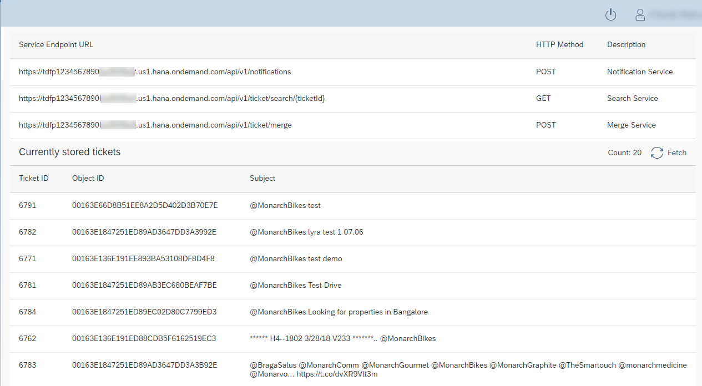

   *Note: The service endpoint URLs are used in the next steps, so it is a good idea to keep the page open.*

## Create and Configure Web Service Mashups in SAP Cloud for Customer

To consume data from an external system in SAP Cloud for Customer, you need to create and configure Web Service Mashups for the requested services.

1. Logon to the SAP Cloud for Customer system and chose *ADMINISTRATOR* > *BUSINESS FLEXIBILITY* > *Masup Web Services* from the top menu.

   

2. Create new REST Service from *MASHUP WEB SERVICES* screen.

   

3. In the New Mashup configuration set up the *Search Service* consumption.

    - Service Name - search-ticket-duplicate-finder
    - Authentication Method - None
    - Service Protocol - JSON
    - HTTP Method - GET
    - URL - Search Service URL from your application homepage

   Click on *Extract Parameters* to configure the service input parameters and *Save* the mashup.

   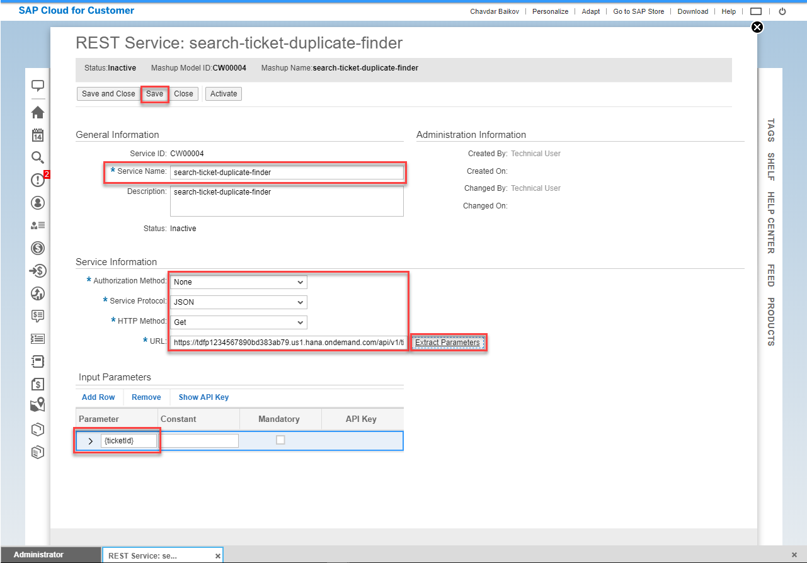

6. *Activate* the mashup and write down its *Search Service ID* for later use.

   

7. After making sure the mashup is active *Close* the mashup configuration screen.   

   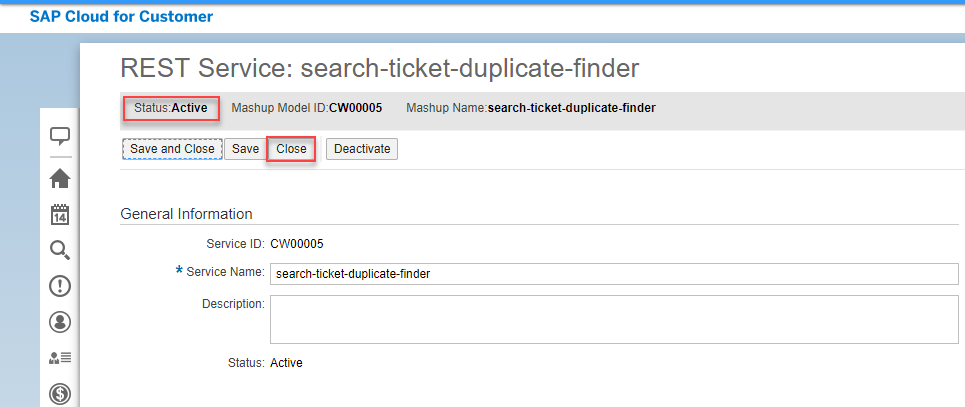

8. Create another new *REST Service* from *MASHUP WEB SERVICES* screen.

   

9. In the New Mashup configuration set up the *Merge Service* consumption.

    - Service Name:             merge-ticket-duplicate-finder
    - Authentication Method:    None
    - Service Protocol:         JSON
    - HTTP Method:              POST
    - Content-type:             FORM
    - URL: Merge Service URL from your application homepage
    - Add two Input Parameters:
       - currentId
       - duplicateId

   *Save*, *Activate* the merge mashup and write down its generated *Merge Service ID* for later use.

   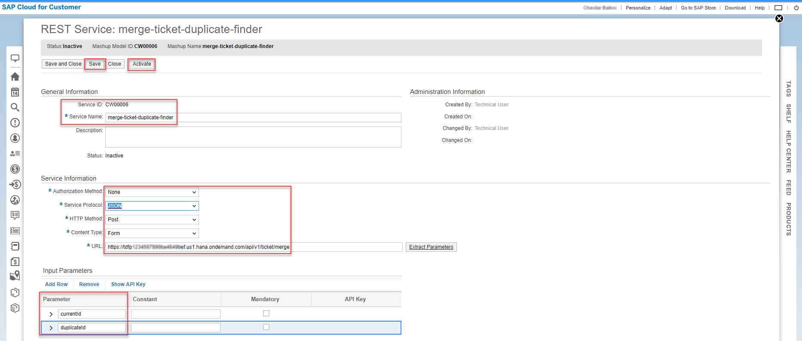

11. Close the mashup configuration screen.
      
## Create and Configure an HTML Mashup of Duplicate Ticket Finder in SAP Cloud for Customer

The benefit of using HTML Mashups for hosting HTML content instead of URL IFrame is that such content does not hit any third party cookie browser restrictions. 
The downside is that the whole widget interface has to be contained in a single HTML page and the communication with the application back-end needs to happen through Web Service Mashups.

The Duplicate Ticket Finder application provides such HTML mashup widget in the eclipse project, which needs to be configured and installed in SAP Cloud for Customer.

1. In Eclipse IDE open the *cloud-c4c-ticker-duplicate-finder* application project.
2. Open the *TicketFinderWidget.html* file in *scr/main/webapp* folder.


3. Find and replace the following variables in the *TicketFinderWidget.html* file with the corresponding values.

            <SearchServiceID>	    Search Service mashup service ID of the Web Service mashup
            <MergeServiceID>	    Merge Service mashup service ID of the Web Service mashup            

4. Save the file *TicketFinderWidget.html* text content in clipboard.
5. Log on to the SAP Cloud for Customer system and chose *Adapt > Launch in Microsoft SilverLight* from the upper right menu.
6. From the *Administrator* menu select *MASHUP AUTHORING* to open mashup authoring screen.


7. Start creating the new HTML mashup, by clicking on *New > HTML Mashup*.


8. In HTML mashup creation screen fill in the following configuration fields:

            Mashup Category:        Productivity & Tools
            Port Binding:	      Ticket Information
            Mashup Name:	      ticket-duplicate-finder
            Status:	            Active
            Type:	                  HTML Code
            HTML Code Editor:	Paste the TicketFinderWidget.html  content you have prepared in the previous steps.

9. Choose *Save and close*.

## Add the Duplicate Ticket Finder Widget to Your Ticket Processing Screen in SAP Cloud for Customer

1. Log on to the SAP Cloud for Customer system and choose *Service > Tickets*.
2. Select *All Tickets* from the ticket filter and open one of the tickets.
3. On the top right corner click on *Personalize > This Screen*.

4. Select one of the screen sections and click on *Add Mashup* button, that appear on the popup menu

5. In the *Mashups and Web Services* screen, find your Mashup and set the *Visible* and *Full Width* checkboxes

6. *Apply* the changes

7. Select *End Personalization* to end screen edit mode.

**Result**

You should now have the application configured and working.


## Configure Subscription for Creating the Tickets Event Notifications in SAP Cloud for Customer

1. Log on to SAP Cloud for Customer system.
2. Go to *ADMINISTRATOR > GENERAL SETTINGS* tab and open the *OData Feed Notification* screen.


3. Choose *Add Row* to add a new subscription.


4. In the newly created row, enter a name for your subscription, for example **TicketFinder**.
5. Enter Consumer Endpoint to the location of Notification Service Endpoint provided by your application.
6. As an *Authentication Type* you can choose *Basic* and enter a random user & password. The application endpoint is not protected. **Don't close this window yet.**
7. In the Subscriptions section add a row and set up the following subscription:

            Business Object Name:    SERVICE_REQUEST
            OData Service:           c4codata
            OData Collection:        ServiceRequestCollection
            Event:                   C - Creation


8. Save the subscription configuration.
9. Test the subscription by creating a new Ticket in the *Service > Tickets* page and observe that the number of tickets in the application index increases.

## Point Of Interest in the Application Code

If you want to dig into the application source code, for convenience we collected a list of notable classes and methods to check. For convenience the Eclipse breakpoints file is available in /src/main/resources/PointsOfInterest.bkpt

| Class             |          Method | Description  |
|-|-|-|
|InitializeListener|contextInitialized|On application start loads initial set of tickets in the index.|
|C4CTicketService|retrieveLastCreatedC4CTickets|Retrieves a set of latest tickets for SAP Cloud for Customer system.|
||retrieveC4CTicketByID|Retrieves specific ticket from SAP Cloud for Customer system.|
|TicketResource|search|REST Service for finding similar tickets to the passed ticket.|
||merge|REST Service that adds ticket and his group to a group of similar tickets.|
|IndexService|add|Adds new ticket to the index in its own group.|
||mergeTickets|Merge two ticket groups.|
||searchForTicket|Finds groups of similar tickets.|
|UserService|getLoggedInUser|Returns logged in user information.|
||logoutUser|Logs out the current user.|
|EventNotificationService|receiveNotificationEvent|REST interface for receiving ticket creation notifications.|

### Copyright and License

```
Copyright 2017 [SAP SE](http://www.sap.com/)

Licensed under the Apache License, Version 2.0 (the "License"); 
you may not use this work except in compliance with the License. 
You may obtain a copy of the License in the LICENSE file, or at 

http://www.apache.org/licenses/LICENSE-2.0 

Unless required by applicable law or agreed to in writing, software 
distributed under the License is distributed on an "AS IS" BASIS, 
WITHOUT WARRANTIES OR CONDITIONS OF ANY KIND, either express or implied. 
See the License for the specific language governing permissions and 
limitations under the License.
```
